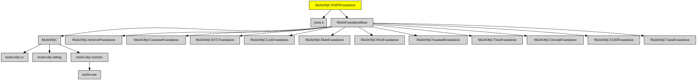

# MulleObjCJSMNFoundation

#### 🌼 JSON support for mulle-objc

JSON parsing, based on the [jsmn](//github.com/zserge/jsmn) parser.

Adds JSON capability for property lists via categories to **NSPropertyListSerialization**.


| Release Version                                       | Release Notes  | AI Documentation
|-------------------------------------------------------|----------------|---------------
|  [](//github.com/MulleWeb/MulleObjCJSMNFoundation/actions) | [RELEASENOTES](RELEASENOTES.md) | [DeepWiki for MulleObjCJSMNFoundation](https://deepwiki.com/MulleWeb/MulleObjCJSMNFoundation)


### You are here




## Add

Use [mulle-sde](//github.com/mulle-sde) to add MulleObjCJSMNFoundation to your project:

``` sh
mulle-sde add github:MulleWeb/MulleObjCJSMNFoundation
```

## Install

### Install with mulle-sde

Use [mulle-sde](//github.com/mulle-sde) to build and install MulleObjCJSMNFoundation and all dependencies:

``` sh
mulle-sde install --prefix /usr/local \
   https://github.com//MulleObjCJSMNFoundation/archive/latest.tar.gz
```

### Manual Installation

Install the requirements:

| Requirements                                 | Description
|----------------------------------------------|-----------------------
| [MulleFoundationBase](https://github.com/MulleFoundation/MulleFoundationBase)             | 🧱 MulleFoundationBase amalgamates Foundations projects
| [mulle-objc-list](https://github.com/mulle-objc/mulle-objc-list)             | 📒 Lists mulle-objc runtime information contained in executables.

Download the latest [tar](https://github.com/MulleWeb/MulleObjCJSMNFoundation/archive/refs/tags/latest.tar.gz) or [zip](https://github.com/MulleWeb/MulleObjCJSMNFoundation/archive/refs/tags/latest.zip) archive and unpack it.

Install **MulleObjCJSMNFoundation** into `/usr/local` with [cmake](https://cmake.org):

``` sh
cmake -B build \
      -DCMAKE_INSTALL_PREFIX=/usr/local \
      -DCMAKE_PREFIX_PATH=/usr/local \
      -DCMAKE_BUILD_TYPE=Release &&
cmake --build build --config Release &&
cmake --install build --config Release
```

### Platforms and Compilers

All platforms and compilers supported by
[mulle-c11](//github.com/mulle-c/mulle-c11).


## Author

[Nat!](https://mulle-kybernetik.com/weblog) for Mulle kybernetiK  

